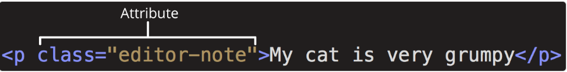
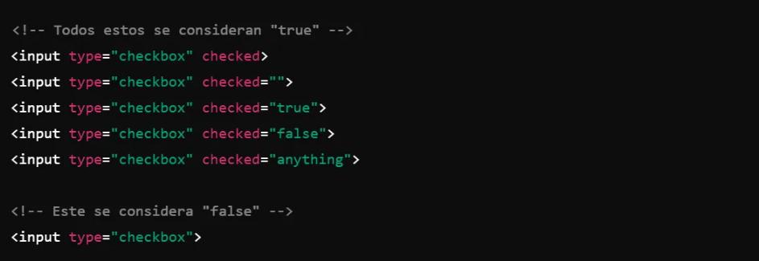
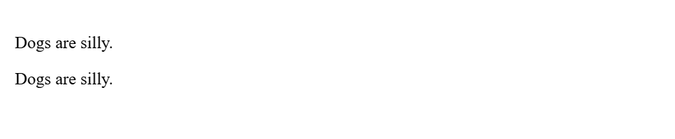
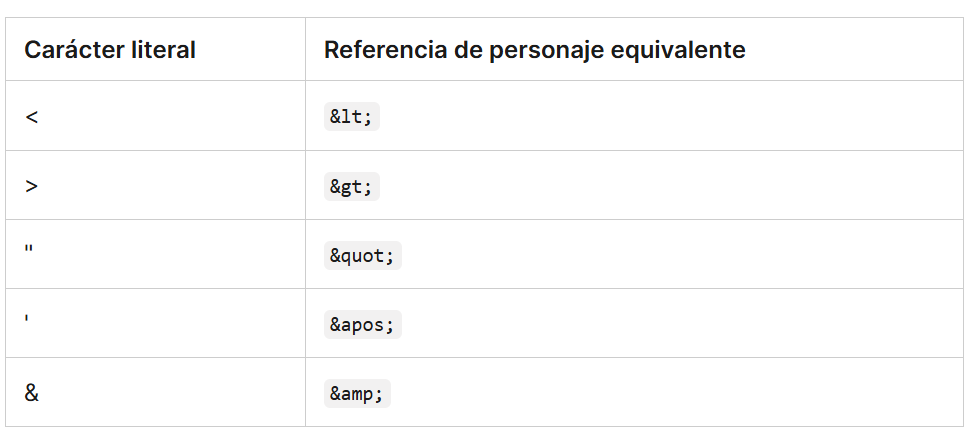
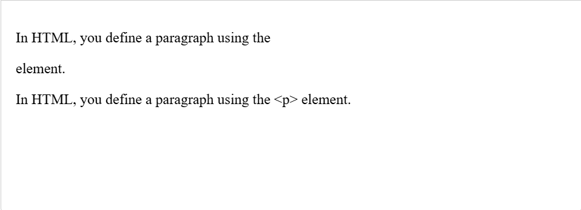
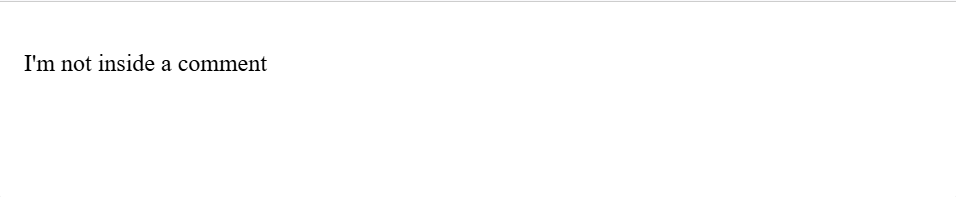

# Curso de HTML5

## Introducción

Este curso te enseñará los fundamentos de HTML5. La información presentada en este curso se basa en la excelente documentación de Mozilla Developer Network (https://developer.mozilla.org/).

HTML es la tecnología que define el contenido y la estructura de cualquier sitio web. Si se escribe correctamente, también debería definir la semántica (el significado) del contenido de forma legible por máquina, lo que es vital para la accesibilidad, la optimización de los motores de búsqueda y el uso de las funciones integradas que ofrecen los navegadores para que el contenido funcione de forma óptima.

## ¿Qué es HTML?
HTML (HyperText Markup Language) es un lenguaje de marcado que indica a los navegadores web cómo estructurar las páginas web que visita. Puede ser tan complicado o tan simple como desee el desarrollador web.

---
### Nota
 Las etiquetas en HTML no distinguen entre mayúsculas y minúsculas. Esto significa que pueden escribirse en mayúsculas o minúsculas. Sin embargo, se recomienda escribir todas las etiquetas en minúsculas para mantener la coherencia y facilitar la lectura.

---
# Anatomía de un elemento HTML

* Etiqueta de apertura: consta del nombre del elemento (en este ejemplo, p de párrafo), entre corchetes angulares de apertura y cierre. Esta etiqueta de apertura marca el inicio del elemento o el comienzo de su efecto. En este ejemplo, precede al inicio del texto del párrafo.

* El contenido: es el contenido del elemento. En este ejemplo, es el texto del párrafo.

* Etiqueta de cierre: es igual que la etiqueta de apertura, excepto que incluye una barra diagonal antes del nombre del elemento. Esto marca dónde termina el elemento. No incluir una etiqueta de cierre es un error común de principiantes que puede producir resultados peculiares.

El elemento es la etiqueta de apertura, seguida del contenido, seguido de la etiqueta de cierre.

# Elementos anidados
Los elementos se pueden colocar dentro de otros elementos. Esto se llama anidamiento . Si quisiéramos decir que nuestro gato está muy gruñón, podríamos incluir la palabra muy en un <strong>elemento, lo que significa que la palabra debe tener un formato de texto más fuerte:

html

My cat is <strong>very</strong> grumpy.

Hay una forma correcta y otra incorrecta de realizar la anidación. abrimos el pelemento primero y luego abrimos el strongelemento. Para una anidación adecuada, debemos cerrar el strongelemento primero, antes de cerrar el p.

El siguiente es un ejemplo de la forma incorrecta de realizar la anidación:

html

My cat is <strong>very grumpy.
</strong> ❌

Las etiquetas deben abrirse y cerrarse de manera que queden dentro o fuera una de la otra .
el navegador debe adivinar cuál es su intención. Este tipo de adivinación puede generar resultados inesperados.

# Elementos vacíos
No todos los elementos siguen el patrón de una etiqueta de apertura, una de contenido y una de cierre. Algunos elementos constan de una sola etiqueta, que normalmente se utiliza para insertar o incrustar algo en el documento. Dichos elementos se denominan elementos void . Por ejemplo, el elemento incrusta un archivo de imagen en una página:

Esto produciría el siguiente resultado:

 Nota: En HTML, no es necesario agregar un /al final de la etiqueta de un elemento void, por ejemplo: .

# Atributos
 Los elementos también pueden tener atributos. Los atributos tienen el siguiente aspecto:
 

 Los atributos contienen información adicional sobre el elemento que no aparecerá en el contenido. En este ejemplo, el classatributo es un nombre de identificación que se utiliza para identificar el elemento con información de estilo.

Un atributo debe tener:

 Un espacio entre este y el nombre del elemento. (Para un elemento con más de un atributo, los atributos también deben estar separados por espacios).
 El nombre del atributo, seguido de un signo igual.
 Un valor de atributo, entre comillas de apertura y cierre.

# Atributos booleanos
 A veces verás atributos escritos sin valores. Esto es completamente aceptable. Estos se llaman atributos booleanos . Cuando un atributo booleano se escribe sin un valor, o con cualquier valor, incluso como "false", el atributo booleano siempre se establece en verdadero. De lo contrario, si el atributo no está escrito en una etiqueta HTML, el atributo se establece en falso. La especificación requiere que el valor del atributo sea una cadena vacía (incluso cuando el atributo no tiene un valor especificado explícitamente) o el mismo que el nombre del atributo, pero otros valores funcionan de la misma manera.

 La presencia de un atributo booleano en estado verdadero (como "false", "0", o incluso una cadena vacía '') en un elemento HTML siempre lo activa , sin importar el contenido que tenga dentro (incluso si está vacío).

 La ausencia del atributo es lo único que lo considera como falso.
 

# Omitir comillas alrededor de los valores de los atributos
 Si observa el código de muchos otros sitios, puede encontrar varios estilos de marcado extraños, incluidos valores de atributos sin comillas. Esto está permitido en determinadas circunstancias, pero también puede dañar su marcado en otras circunstancias. El elemento en el fragmento de código a continuación, <a>, se llama ancla. Las anclas encierran texto y lo convierten en enlaces. El hrefatributo especifica la dirección web a la que apunta el enlace. Puede escribir esta versión básica a continuación solo con el hrefatributo, de esta manera:
 
 <a href=https://www.mozilla.org/>favorite website</a>

 Los anclajes también pueden tener un titleatributo, una descripción de la página enlazada. Sin embargo, tan pronto como los agregamos titlede la misma manera que el hrefatributo, surgen problemas:

 <a href=https://www.mozilla.org/ title=The Mozilla homepage>favorite website</a>

 Como se escribió anteriormente, el navegador malinterpreta el marcado, confundiendo el titleatributo con tres atributos: un atributo de título con el valor The, y dos atributos booleanos, Mozillay homepage. Obviamente, esto no es intencional. Provocará errores o un comportamiento inesperado, como puede ver en el ejemplo en vivo a continuación. 
 
 #### Incluya siempre las comillas de los atributos. Esto evita este tipo de problemas y da como resultado un código más legible.

# ¿Comillas simples o dobles?
 En este artículo, también notarás que los atributos están entre comillas dobles. Sin embargo, es posible que veas comillas simples en algún código HTML. Esto es una cuestión de estilo. Puedes elegir libremente la que prefieras. Ambas líneas son equivalentes:

 <a href='https://www.example.com'>A link to my example.</a>

 <a href="https://www.example.com">A link to my example.</a>

 #### Asegúrese de no mezclar comillas simples y dobles. 

 Para utilizar comillas dentro de otras comillas del mismo tipo (comillas simples o comillas dobles), utilice referencias de caracteres . Lo veremos mas adelante.

# Anatomía de un documento HTML
Los elementos HTML individuales no son muy útiles por sí solos. A continuación, examinemos cómo se combinan los elementos individuales para formar una página HTML completa:

<!doctype html>
<html lang="en-US">
  <head>
    <meta charset="utf-8" />
    <title>My test page</title>
  </head>
  <body>
    
This is my page

  </body>
</html>

Aquí tenemos:
 <!DOCTYPE html> no es una etiqueta HTML, sino una declaración que asegura que los navegadores interpretan tu documento correctamente y en modo estándar, ayudando a garantizar un comportamiento predecible en todos los navegadores modernos.

 <html></html>: El <html>elemento. Este elemento envuelve todo el contenido de la página. A veces se lo conoce como elemento raíz.

 <head></head>: El <head>elemento. Este elemento actúa como un contenedor para todo lo que desea incluir en la página HTML, que no sea el contenido que la página mostrará a los visitantes.

 <meta charset="utf-8">: El elemento <meta>es una etiqueta que proporciona metadatos sobre el documento HTML, es decir, información que no se muestra directamente en la página, pero que es importante para los navegadores y motores de búsqueda. El atributo especifica la codificación de caracteres para su documento como UTF-8, que incluye la mayoría de los caracteres de la gran mayoría de los idiomas escritos por humanos. Con esta configuración, la página ahora puede manejar cualquier contenido textual que pueda contener

 <title></title>: El <title>elemento. Establece el título de la página, que es el título que aparece en la pestaña del navegador en la que se carga la página.

 <body></body>: El <body>elemento. Contiene todo el contenido que se muestra en la página, incluidos texto, imágenes, videos, juegos, pistas de audio reproducibles y cualquier otra cosa.

# Espacios en blanco en HTML
En los ejemplos anteriores, es posible que hayas notado que se incluyen muchos espacios en blanco en el código. Esto es opcional. Estos dos fragmentos de código son equivalentes:
 
 
Dogs are silly.

 
Dogs
    are
        silly.

 No importa cuánto espacio en blanco utilices dentro del contenido de un elemento HTML (que puede incluir uno o más caracteres de espacio, pero también saltos de línea), el analizador HTML reduce cada secuencia de espacios en blanco a un solo espacio al representar el código. Entonces, ¿por qué utilizar tanto espacio en blanco? La respuesta es la legibilidad.

 Puede resultar más fácil comprender lo que sucede en su código si lo tiene bien formateado. En nuestro HTML, cada elemento anidado tiene una sangría de dos espacios más que el que se encuentra dentro. Usted decide el estilo de formato cuántos espacios para cada nivel de sangría.

 Veamos cómo el navegador representa los dos párrafos anteriores con y sin espacios en blanco:

 

# Referencias de caracteres: incluir caracteres especiales en HTML
 En HTML, los caracteres <, >, ", 'y &son caracteres especiales. Forman parte de la sintaxis HTML en sí. ¿Cómo se incluye uno de estos caracteres especiales en el texto? Por ejemplo, si se desea utilizar un signo & o un signo menor que, sin que se interprete como código.

 Para ello, se utilizan referencias de caracteres . Se trata de códigos especiales que representan caracteres y que se utilizan en estas circunstancias concretas. Cada referencia de carácter comienza con un ampersand (&) y termina con un punto y coma (;).

 
 
 En el siguiente ejemplo, hay dos párrafos:

 
In HTML, you define a paragraph using the 
 element.

 
In HTML, you define a paragraph using the &lt;p&gt; element.

 En la salida en vivo que se muestra a continuación, puede ver que el primer párrafo está mal. El navegador interpreta la segunda instancia de 
como el inicio de un nuevo párrafo. El segundo párrafo se ve bien porque tiene corchetes angulares con referencias de caracteres.

 

 Nota: No es necesario utilizar referencias de entidad para ningún otro símbolo, ya que los navegadores modernos manejarán los símbolos reales sin problemas siempre que la codificación de caracteres de su HTML esté configurada en UTF-8 .

# Comentarios HTML
 HTML tiene un mecanismo para escribir comentarios en el código. Los navegadores ignoran los comentarios, lo que hace que sean invisibles para el usuario. El propósito de los comentarios es permitirle incluir notas en el código para explicar su lógica o codificación. 

 Para escribir un comentario HTML, enciérrelo entre los marcadores especiales <!--y -->. Por ejemplo:

 
I'm not inside a comment

 <!-- 
I am!
 -->

 Como puede ver a continuación, solo se muestra el primer párrafo en la salida en vivo.
 

 texto de prueva

---
