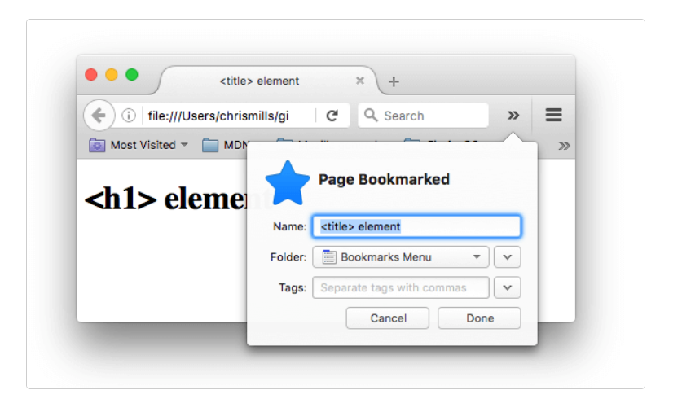
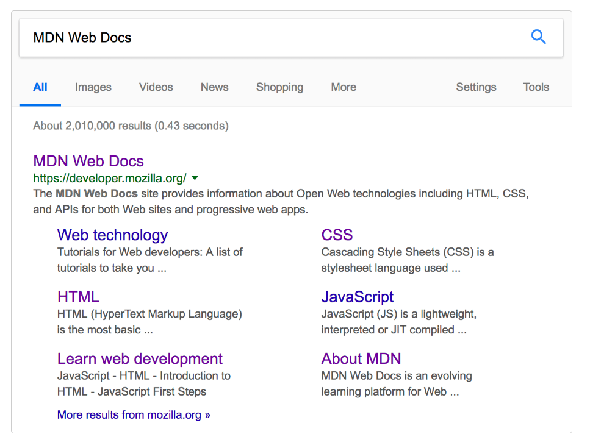
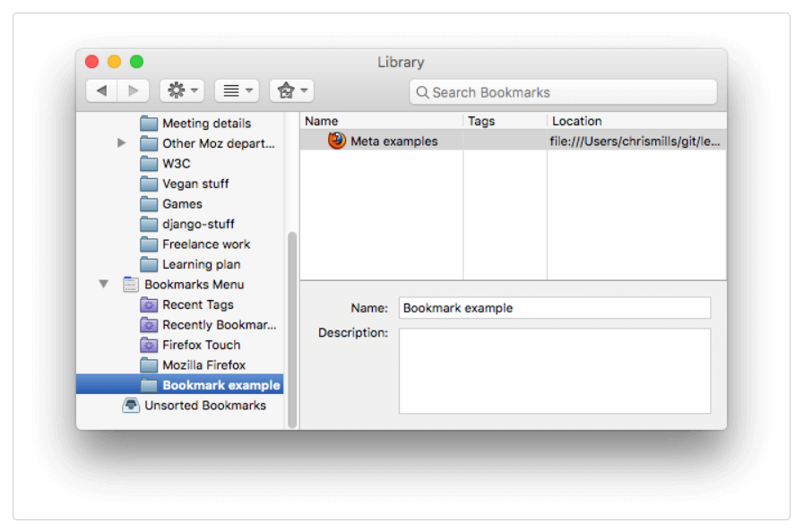

# Curso de HTML5

## Introducción

Este curso te enseñará los fundamentos de HTML5. La información presentada en este curso se basa en la excelente documentación de Mozilla Developer Network (https://developer.mozilla.org/).

HTML es la tecnología que define el contenido y la estructura de cualquier sitio web. Si se escribe correctamente, también debería definir la semántica (el significado) del contenido de forma legible por máquina, lo que es vital para la accesibilidad, la optimización de los motores de búsqueda y el uso de las funciones integradas que ofrecen los navegadores para que el contenido funcione de forma óptima.

## ¿Qué es HTML?
HTML (HyperText Markup Language) es un lenguaje de marcado que indica a los navegadores web cómo estructurar las páginas web que visita. Puede ser tan complicado o tan simple como desee el desarrollador web.


### Nota
 > Las etiquetas en HTML no distinguen entre mayúsculas y minúsculas. Esto significa que > pueden escribirse en mayúsculas o minúsculas. Sin embargo, se recomienda escribir    > todas las etiquetas en minúsculas para mantener la coherencia y facilitar la lectura.


# Anatomía de un elemento HTML

* Etiqueta de apertura: consta del nombre del elemento (en este ejemplo, p de párrafo), entre corchetes angulares de apertura y cierre. Esta etiqueta de apertura marca el inicio del elemento o el comienzo de su efecto. En este ejemplo, precede al inicio del texto del párrafo.

* El contenido: es el contenido del elemento. En este ejemplo, es el texto del párrafo.

* Etiqueta de cierre: es igual que la etiqueta de apertura, excepto que incluye una barra diagonal antes del nombre del elemento. Esto marca dónde termina el elemento. No incluir una etiqueta de cierre es un error común de principiantes que puede producir resultados peculiares.

El elemento es la etiqueta de apertura, seguida del contenido, seguido de la etiqueta de cierre.


# Elementos anidados
Los elementos se pueden colocar dentro de otros elementos. Esto se llama anidamiento . Si quisiéramos decir que nuestro gato está muy gruñón, podríamos incluir la palabra muy en un `<strong>` elemento, lo que significa que la palabra debe tener un formato de texto más fuerte:

html
```html
<p>My cat is <strong>very</strong> grumpy.</p>
```
Hay una forma correcta y otra incorrecta de realizar la anidación. abrimos el pelemento primero y luego abrimos el strongelemento. Para una anidación adecuada, debemos cerrar el strongelemento primero, antes de cerrar el p.

El siguiente es un ejemplo de la forma incorrecta de realizar la anidación:

html
```html
<p>My cat is <strong>very grumpy.</p></strong> ❌
```
Las etiquetas deben abrirse y cerrarse de manera que queden dentro o fuera una de la otra .
el navegador debe adivinar cuál es su intención. Este tipo de adivinación puede generar resultados inesperados.

# Elementos vacíos
No todos los elementos siguen el patrón de una etiqueta de apertura, una de contenido y una de cierre. Algunos elementos constan de una sola etiqueta, que normalmente se utiliza para insertar o incrustar algo en el documento. Dichos elementos se denominan elementos void . Por ejemplo, el `` elemento incrusta un archivo de imagen en una página:

```html

```

Esto produciría el siguiente resultado:


 # Nota: 
 > En HTML, no es necesario agregar un /al final de la etiqueta de un elemento void, por > ejemplo: ``.

# Atributos
 Los elementos también pueden tener atributos. Los atributos tienen el siguiente aspecto:

 

 Los atributos contienen información adicional sobre el elemento que no aparecerá en el contenido. En este ejemplo, el classatributo es un nombre de identificación que se utiliza para identificar el elemento con información de estilo.

Un atributo debe tener:

 Un espacio entre este y el nombre del elemento. (Para un elemento con más de un atributo, los atributos también deben estar separados por espacios).
 El nombre del atributo, seguido de un signo igual.
 Un valor de atributo, entre comillas de apertura y cierre.

# Atributos booleanos
 A veces verás atributos escritos sin valores. Esto es completamente aceptable. Estos se llaman atributos booleanos . Cuando un atributo booleano se escribe sin un valor, o con cualquier valor, incluso como "false", el atributo booleano siempre se establece en verdadero. De lo contrario, si el atributo no está escrito en una etiqueta HTML, el atributo se establece en falso. La especificación requiere que el valor del atributo sea una cadena vacía (incluso cuando el atributo no tiene un valor especificado explícitamente) o el mismo que el nombre del atributo, pero otros valores funcionan de la misma manera.

 La presencia de un atributo booleano en estado verdadero (como "false", "0", o incluso una cadena vacía '') en un elemento HTML siempre lo activa , sin importar el contenido que tenga dentro (incluso si está vacío).

 La ausencia del atributo es lo único que lo considera como falso.
 


# Omitir comillas alrededor de los valores de los atributos
 Si observa el código de muchos otros sitios, puede encontrar varios estilos de marcado extraños, incluidos valores de atributos sin comillas. Esto está permitido en determinadas circunstancias, pero también puede dañar su marcado en otras circunstancias. El elemento en el fragmento de código a continuación, `<a>`, se llama ancla. Las anclas encierran texto y lo convierten en enlaces. El hrefatributo especifica la dirección web a la que apunta el enlace. Puede escribir esta versión básica a continuación solo con el hrefatributo, de esta manera:
 
 ```html
 <a href=https://www.mozilla.org/>favorite website</a>
```

 Los anclajes también pueden tener un titleatributo, una descripción de la página enlazada. Sin embargo, tan pronto como los agregamos titlede la misma manera que el hrefatributo, surgen problemas:

```html
 <a href=https://www.mozilla.org/ title=The Mozilla homepage>favorite website</a>
```

 Como se escribió anteriormente, el navegador malinterpreta el marcado, confundiendo el titleatributo con tres atributos: un atributo de título con el valor The, y dos atributos booleanos, Mozillay homepage. Obviamente, esto no es intencional. Provocará errores o un comportamiento inesperado, como puede ver en el ejemplo en vivo a continuación. 
 
 #### Incluya siempre las comillas de los atributos. Esto evita este tipo de problemas y da como resultado un código más legible.


# ¿Comillas simples o dobles?
 En este artículo, también notarás que los atributos están entre comillas dobles. Sin embargo, es posible que veas comillas simples en algún código HTML. Esto es una cuestión de estilo. Puedes elegir libremente la que prefieras. Ambas líneas son equivalentes:
```html
 <a href='https://www.example.com'>A link to my example.</a>

 <a href="https://www.example.com">A link to my example.</a>
```
 #### Asegúrese de no mezclar comillas simples y dobles. 

 Para utilizar comillas dentro de otras comillas del mismo tipo (comillas simples o comillas dobles), utilice referencias de caracteres . Lo veremos mas adelante.


# Anatomía de un documento HTML
Los elementos HTML individuales no son muy útiles por sí solos. A continuación, examinemos cómo se combinan los elementos individuales para formar una página HTML completa:
```html
<!doctype html>
<html lang="en-US">
  <head>
    <meta charset="utf-8" />
    <title>My test page</title>
  </head>
  <body>
    <p>This is my page</p>
  </body>
</html>
```
Aquí tenemos:
 `<!DOCTYPE html>` no es una etiqueta HTML, sino una declaración que asegura que los navegadores interpretan tu documento correctamente y en modo estándar, ayudando a garantizar un comportamiento predecible en todos los navegadores modernos.

 `<html></html>`: El `<html>` elemento. Este elemento envuelve todo el contenido de la página. A veces se lo conoce como elemento raíz.

 `<head></head>`: El `<head>` elemento. Este elemento actúa como un contenedor para todo lo que desea incluir en la página HTML, que no sea el contenido que la página mostrará a los visitantes.

 `<meta charset="utf-8">`: El elemento `<meta>` es una etiqueta que proporciona metadatos sobre el documento HTML, es decir, información que no se muestra directamente en la página, pero que es importante para los navegadores y motores de búsqueda. El atributo especifica la codificación de caracteres para su documento como UTF-8, que incluye la mayoría de los caracteres de la gran mayoría de los idiomas escritos por humanos. Con esta configuración, la página ahora puede manejar cualquier contenido textual que pueda contener

```html
 <title></title>: El <title>elemento. Establece el título de la página, que es el título que aparece en la pestaña del navegador en la que se carga la página.

 <body></body>: El <body>elemento. Contiene todo el contenido que se muestra en la página, incluidos texto, imágenes, videos, juegos, pistas de audio reproducibles y cualquier otra cosa.
```

# Espacios en blanco en HTML
En los ejemplos anteriores, es posible que hayas notado que se incluyen muchos espacios en blanco en el código. Esto es opcional. Estos dos fragmentos de código son equivalentes:
 
 ```html
 <p id="noWhitespace">Dogs are silly.</p>

 <p id="whitespace">Dogs
    are
        silly.</p>
 ```
 No importa cuánto espacio en blanco utilices dentro del contenido de un elemento HTML (que puede incluir uno o más caracteres de espacio, pero también saltos de línea), el analizador HTML reduce cada secuencia de espacios en blanco a un solo espacio al representar el código. Entonces, ¿por qué utilizar tanto espacio en blanco? La respuesta es la legibilidad.

 Puede resultar más fácil comprender lo que sucede en su código si lo tiene bien formateado. En nuestro HTML, cada elemento anidado tiene una sangría de dos espacios más que el que se encuentra dentro. Usted decide el estilo de formato cuántos espacios para cada nivel de sangría.

 Veamos cómo el navegador representa los dos párrafos anteriores con y sin espacios en blanco:

 


# Referencias de caracteres: incluir caracteres especiales en HTML
 En HTML, los caracteres <, >, ", 'y &son caracteres especiales. Forman parte de la sintaxis HTML en sí. ¿Cómo se incluye uno de estos caracteres especiales en el texto? Por ejemplo, si se desea utilizar un signo & o un signo menor que, sin que se interprete como código.

 Para ello, se utilizan referencias de caracteres . Se trata de códigos especiales que representan caracteres y que se utilizan en estas circunstancias concretas. Cada referencia de carácter comienza con un ampersand (&) y termina con un punto y coma (;).

 
 
 En el siguiente ejemplo, hay dos párrafos:

```html
 <p>In HTML, you define a paragraph using the <p> element.</p>

 <p>In HTML, you define a paragraph using the &lt;p&gt; element.</p>
```
 En la salida en vivo que se muestra a continuación, puede ver que el primer párrafo está mal. El navegador interpreta la segunda instancia de `<p>` como el inicio de un nuevo párrafo. El segundo párrafo se ve bien porque tiene corchetes angulares con referencias de caracteres.

 

 Nota: No es necesario utilizar referencias de entidad para ningún otro símbolo, ya que los navegadores modernos manejarán los símbolos reales sin problemas siempre que la codificación de caracteres de su HTML esté configurada en UTF-8 .


# Comentarios HTML
 HTML tiene un mecanismo para escribir comentarios en el código. Los navegadores ignoran los comentarios, lo que hace que sean invisibles para el usuario. El propósito de los comentarios es permitirle incluir notas en el código para explicar su lógica o codificación. 

 Para escribir un comentario HTML, enciérrelo entre los marcadores especiales `<!--y -->`. Por ejemplo:

```html
 <p>I'm not inside a comment</p>

 <!-- <p>I am!</p> -->
```

 Como puede ver a continuación, solo se muestra el primer párrafo en la salida en vivo.
 

# ¿Qué hay en el Head? Metadatos de la página web
 El encabezado de un documento HTML es la parte que no se muestra en el navegador web cuando se carga la página. Contiene información de metadatos, como la página `<title>`, enlaces a CSS, enlaces a faviconos personalizados y otros metadatos (datos sobre el HTML, como el autor y palabras clave importantes que describen el documento).

 Los navegadores web utilizan la información contenida en el encabezado para representar correctamente el documento HTML. 

 # ¿Qué es el encabezado HTML?
  El encabezado HTML es el contenido del `<head>` elemento. A diferencia del contenido del `<body>` elemento (que se muestra en la página cuando se carga en un navegador), el contenido del encabezado no se muestra en la página. En cambio, la función del encabezado es contener metadatos sobre el documento.

```html
     <head>
        <meta charset="utf-8" />
        <title>My test page</title>
     </head>
```
 Sin embargo, en páginas más grandes, el encabezado puede llegar a ser bastante grande. 

# Agregar un título

 El `<title>` elemento son metadatos que representan el título del documento HTML general (no el contenido del documento).

 

 Los `<title>`contenidos también se utilizan en los resultados de búsqueda, como verás a continuación.


# Metadatos: el <meta>elemento
 Los metadatos son datos que describen datos, y HTML tiene una forma "oficial" de agregar metadatos a un documento: el `<meta>` elemento. Por supuesto, el resto de elementos de los que hablamos en este artículo también se pueden considerar metadatos. Hay muchos tipos diferentes de `<meta>` elementos que se pueden incluir en el archivo de tu página `<head>`, pero no intentaremos explicarlos todos en esta etapa, ya que sería demasiado confuso.

 Cómo especificar la codificación de caracteres de su documento
 En el ejemplo que vimos arriba, se incluyó esta línea:

 ```html
 <meta charset="utf-8" />
 ```

 Este elemento especifica la codificación de caracteres del documento, es decir, el conjunto de caracteres que el documento puede utilizar. utf-8es un conjunto de caracteres universal que incluye prácticamente cualquier carácter de cualquier idioma. Esto significa que su página web podrá mostrar cualquier idioma, por lo que es una buena idea configurarlo en todas las páginas web que cree. 
 
 Nota: algunos navegadores (como Chrome) corrigen automáticamente las codificaciones incorrectas, por lo que, según el navegador que uses, es posible que no veas este problema. De todas formas, debes configurar una codificación `utf-8` en tu página para evitar posibles problemas en otros navegadores.

# Aprendizaje activo: Experimente con la codificación de caracteres

 Agregar un autor y una descripción
Muchos `<meta>` elementos incluyen namey contentatribuyen:

 name: especifica el tipo de metaelemento que es; qué tipo de información contiene.
 conten: tespecifica el contenido meta real.
 Dos de estos metaelementos que son útiles para incluir en tu página definen el autor de la página y brindan una descripción concisa de la misma. Veamos un ejemplo:
```html
<meta name="author" content="Chris Mills" />
<meta
  name="description"
  content="The MDN Web Docs Learning Area aims to provide
complete beginners to the Web with all they need to know to get
started with developing websites and applications." />
```

 Especificar un autor es beneficioso de muchas maneras: es útil para saber quién escribió la página, si tienes alguna pregunta sobre el contenido y te gustaría contactarlo. Algunos sistemas de administración de contenido tienen funciones para extraer automáticamente la información del autor de la página y ponerla a disposición para tales fines.

 Especificar una descripción que incluya palabras clave relacionadas con el contenido de su página es útil ya que tiene el potencial de hacer que su página aparezca más arriba en las búsquedas relevantes realizadas en los motores de búsqueda (estas actividades se denominan Optimización de motores de búsqueda o SEO ).

# Aprendizaje activo: El uso de la descripción en los buscadores
La descripción también se utiliza en las páginas de resultados de los motores de búsqueda. Realicemos un ejercicio para explorar esto

```html
<meta
  name="description"
  content="The MDN Web Docs site
  provides information about Open Web technologies
  including HTML, CSS, and APIs for both websites and
  progressive web apps." />
```


Nota: Muchas `<meta>` funciones ya no se utilizan. Por ejemplo, el <meta>elemento de palabra clave (html `<meta name="keywords" content="fill, in, your, keywords, here">`), que se supone que proporciona palabras clave para que los motores de búsqueda determinen la relevancia de esa página para diferentes términos de búsqueda, es ignorado por los motores de búsqueda, porque los spammers simplemente llenaban la lista de palabras clave con cientos de palabras clave, lo que sesgaba los resultados.
 
# Otros tipos de metadatos
A medida que navegue por la web, también encontrará otros tipos de metadatos. Muchas de las funciones que verá en los sitios web son creaciones exclusivas diseñadas para proporcionar a ciertos sitios (como los sitios de redes sociales) información específica que pueden usar.

Por ejemplo, [Open Graph Data](https://ogp.me/) es un protocolo de metadatos que inventó Facebook para proporcionar metadatos más completos a los sitios web. En el código fuente de MDN Web Docs, encontrará lo siguiente:

```html
<meta
  property="og:image"
  content="https://developer.mozilla.org/mdn-social-share.png" />
<meta
  property="og:description"
  content="The Mozilla Developer Network (MDN) provides
information about Open Web technologies including HTML, CSS, and APIs for both websites
and HTML Apps." />
<meta property="og:title" content="Mozilla Developer Network" />
```

Un efecto de esto es que cuando se vincula a MDN Web Docs en Facebook, el enlace aparece junto con una imagen y una descripción: una experiencia más rica para los usuarios.


# Cómo agregar iconos personalizados a su sitio
Para enriquecer aún más el diseño de su sitio, puede agregar referencias a íconos personalizados en sus metadatos, y estos se mostrarán en ciertos contextos. El más utilizado es el favicon (abreviatura de "ícono de favoritos", en referencia a su uso en las listas de "favoritos" o "marcadores" de los navegadores).

El humilde favicono existe desde hace muchos años. Es el primer icono de este tipo: un icono cuadrado de 16 píxeles que se utiliza en varios lugares. Es posible que veas (según el navegador) los faviconos en la pestaña del navegador que contiene cada página abierta y junto a las páginas marcadas en el panel de marcadores.

Se puede agregar un favicon a tu página de la siguiente manera:

 * Guardándolo en el mismo directorio que la página de índice del sitio, guardado en . icoformato (la mayoría también admite faviconos en formatos más comunes como .gifo .png)

 * Agregando la siguiente línea en tu bloque HTML `<head>` para hacer referencia a él:

```html
 <link rel="icon" href="favicon.ico" type="image/x-icon" />
 ```
A continuación se muestra un ejemplo de un favicono en un panel de marcadores:



También es posible que necesites distintos iconos para distintos contextos. Por ejemplo, encontrarás esto en el código fuente de la página de inicio de MDN Web Docs:

```html
<link rel="icon" href="/favicon-48x48.[some hex hash].png" />
<link rel="apple-touch-icon" href="/apple-touch-icon.[some hex hash].png" />
```

Esta es una forma de hacer que el sitio muestre un ícono cuando se guarde en la pantalla de inicio de un dispositivo Apple. Es posible que incluso desee proporcionar íconos diferentes para diferentes dispositivos, para garantizar que el ícono se vea bien en todos los dispositivos. Por ejemplo:

```html
<!-- iPad Pro with high-resolution Retina display: -->
<link
  rel="apple-touch-icon"
  sizes="167x167"
  href="/apple-touch-icon-167x167.png" />
<!-- 3x resolution iPhone: -->
<link
  rel="apple-touch-icon"
  sizes="180x180"
  href="/apple-touch-icon-180x180.png" />
<!-- non-Retina iPad, iPad mini, etc.: -->
<link
  rel="apple-touch-icon"
  sizes="152x152"
  href="/apple-touch-icon-152x152.png" />
<!-- 2x resolution iPhone and other devices: -->
<link rel="apple-touch-icon" href="/apple-touch-icon-120x120.png" />
<!-- basic favicon -->
<link rel="icon" href="/favicon.ico" />
```

Los comentarios explican para qué se utiliza cada ícono: estos elementos cubren cosas como proporcionar un lindo ícono de alta resolución para usar cuando el sitio web se guarda en la pantalla de inicio de un iPad.

No te preocupes demasiado por implementar todos estos tipos de íconos ahora mismo: se trata de una función bastante avanzada y no se espera que tengas conocimientos sobre ella para avanzar en el curso. El objetivo principal de este artículo es informarte sobre qué son esas cosas, en caso de que te las encuentres mientras navegas por el código fuente de otros sitios web. Si quieres aprender más sobre todos estos valores y cómo elegirlos, lee la [<link>](https://developer.mozilla.org/en-US/docs/Web/HTML/Element/link) página de referencia del elemento.

# Aplicación de CSS y JavaScript a HTML
Casi todos los sitios web que utilizas en la actualidad emplean CSS para que tengan un aspecto atractivo y JavaScript para potenciar la funcionalidad interactiva, como reproductores de vídeo, mapas, juegos y más. Estos se aplican con mayor frecuencia a una página web mediante el `<link>` elemento y el `<script>` elemento, respectivamente.

El `<link>` elemento siempre debe ir dentro del encabezado del documento. Esto requiere dos atributos, rel="stylesheet", que indica que es la hoja de estilo del documento, y href, que contiene la ruta al archivo de la hoja de estilo:

```html
<link rel="stylesheet" href="my-css-file.css" />
```

El `<script>` elemento también debe ir en el encabezado y debe incluir un srcatributo que contenga la ruta al JavaScript que desea cargar, y defer, que básicamente le indica al navegador que cargue el JavaScript después de que la página haya terminado de analizar el HTML. Esto es útil ya que garantiza que todo el HTML esté cargado antes de que se ejecute el JavaScript, de modo que no obtenga errores resultantes de que JavaScript intente acceder a un elemento HTML que aún no existe en la página. En realidad, hay varias formas de manejar la carga de JavaScript en su página, pero esta es la más confiable para usar en los navegadores modernos (para otros, lea Estrategias de carga de scripts ).

```html
<script src="my-js-file.js" defer></script>
```

# Establecer el idioma principal del documento
Por último, vale la pena mencionar que puedes (y realmente deberías) configurar el idioma de tu página. Esto se puede hacer agregando el atributo lang a la etiqueta HTML de apertura (como se ve en el meta-example.html y se muestra a continuación).
```html
<html lang="en-US">
  …
</html>
```

Esto resulta útil de muchas maneras. Los motores de búsqueda indexarán su documento HTML de manera más eficaz si se configura su idioma lo que le permitirá aparecer correctamente en los resultados específicos del idioma.

También puedes configurar subsecciones de tu documento para que se reconozcan en distintos idiomas. Por ejemplo, podríamos configurar nuestra sección en japonés para que se reconozca como japonés, de la siguiente manera:
```html
<p>Japanese example: <span lang="ja">ご飯が熱い。</span>.</p>
```

Estos códigos están definidos por la norma [ISO 639-1](https://en.wikipedia.org/wiki/ISO_639-1) . Puedes encontrar más información sobre ellos en Etiquetas de idioma en [HTML y XML](https://www.w3.org/International/articles/language-tags/) .


# Encabezados y párrafos en HTML
Una de las principales funciones del HTML es dar estructura al texto para que un navegador pueda mostrar un documento HTML de la forma en que lo desea su desarrollador.

Encabezados y párrafos
La mayoría de los textos estructurados se componen de títulos y párrafos, ya sea que esté leyendo una historia, un periódico, un libro de texto universitario, una revista, etc.


El contenido estructurado hace que la experiencia de lectura sea más fácil y agradable.

En HTML, cada párrafo debe estar envuelto en un `<p>` elemento, de la siguiente manera:
```html
<p>I am a paragraph, oh yes I am.</p>
```

Cada encabezado debe estar envuelto en un elemento de encabezado:
```html
<h1>I am the title of the story.</h1>
```
Hay seis elementos de encabezado: h1 , h2 , h3 , h4 , h5 y h6 . Cada elemento representa un nivel diferente de contenido en el documento: `<h1>` representa el encabezado principal, `<h2>` representa subtítulos, `<h3>` representa subsubtítulos, etc.

# Implementación de la jerarquía estructural
Por ejemplo, en esta historia, el `<h1>` elemento representa el título de la historia, los `<h2>` elementos representan el título de cada capítulo y los `<h3>` elementos representan subsecciones de cada capítulo:

```html
<h1>The Crushing Bore</h1>

<p>By Chris Mills</p>

<h2>Chapter 1: The dark night</h2>

<p>
  It was a dark night. Somewhere, an owl hooted. The rain lashed down on the…
</p>

<h2>Chapter 2: The eternal silence</h2>

<p>Our protagonist could not so much as a whisper out of the shadowy figure…</p>

<h3>The specter speaks</h3>

<p>
  Several more hours had passed, when all of a sudden the specter sat bolt
  upright and exclaimed, "Please have mercy on my soul!"
</p>
```

Depende de usted qué representan los elementos involucrados, siempre que la jerarquía tenga sentido. Solo debe tener en cuenta algunas prácticas recomendadas al crear dichas estructuras:

* Lo mejor es utilizar uno solo `<h1>` por página: este es el encabezado de nivel superior y todos los demás se ubican debajo de este en la jerarquía.

* Asegúrate de utilizar los títulos en el orden correcto en la jerarquía. No utilices `<h3>` elementos para representar subtítulos seguidos de `<h2>` otros elementos para representar subtítulos secundarios, ya que eso no tiene sentido y dará lugar a resultados extraños.

* De los seis niveles de encabezado disponibles, debe intentar utilizar no más de tres por página, a menos que considere que es necesario. Los documentos con muchos niveles (por ejemplo, una jerarquía de encabezados profunda) se vuelven difíciles de manejar y de navegar. En tales ocasiones, es recomendable distribuir el contenido en varias páginas, si es posible.


# ¿Por qué necesitamos la semántica?
La semántica es un elemento que nos rodea en todas partes: nos basamos en la experiencia previa para saber cuál es la función de un objeto cotidiano; cuando vemos algo, sabemos cuál será su función. Así, por ejemplo, esperamos que un semáforo en rojo signifique "parar" y uno en verde, "avanzar". Las cosas pueden complicarse muy rápidamente si se aplica la semántica incorrecta. (¿Hay algún país que utilice el rojo para significar "avanzar"? Esperamos que no.)

De manera similar, debemos asegurarnos de que estamos utilizando los elementos correctos, dándole a nuestro contenido el significado, la función o la apariencia correcta. En este contexto, el elemento h1 también es un elemento semántico, que le otorga al texto que lo rodea la función (o significado) de "un encabezado de nivel superior en su página".

```html
<h1>This is a top level heading</h1>
```

De forma predeterminada, el navegador le dará un tamaño de fuente grande para que parezca un encabezado (aunque podría darle el estilo que quisiera usando CSS). Más importante aún, su valor semántico se usará de múltiples maneras, por ejemplo, por los motores de búsqueda y los lectores de pantalla.

Por otra parte, puedes hacer que cualquier elemento parezca un encabezado de nivel superior. Considera lo siguiente:

```html
<span style="font-size: 32px; margin: 21px 0; display: block;">
  Is this a top level heading?
</span>
```

Este es un `<span>` elemento. No tiene semántica. Lo usas para envolver contenido cuando quieres aplicarle CSS (o hacerle algo con JavaScript) sin darle ningún significado adicional. (Descubrirás más sobre esto más adelante en el curso). Le hemos aplicado algo de CSS para que parezca un encabezado de nivel superior, pero como no tiene valor semántico, no obtendrá ninguno de los beneficios adicionales descritos anteriormente. Es una buena idea usar el elemento HTML relevante para el trabajo.


# Énfasis e importancia
El artículo anterior analizó por qué la semántica es importante en HTML y se centró en los encabezados y párrafos. Este artículo continúa con el tema de la semántica y analiza los elementos HTML que aplican énfasis e importancia al texto (en paralelo al texto en cursiva y negrita en los medios impresos).

# ¿Qué son el énfasis y la importancia?
En el lenguaje humano, a menudo enfatizamos ciertas palabras para alterar el significado de una oración y, a menudo, queremos marcar ciertas palabras como importantes o diferentes de alguna manera. HTML proporciona varios elementos semánticos que nos permiten marcar contenido textual con tales efectos y, en esta sección, veremos algunos de los más comunes.

# Énfasis
Cuando queremos añadir énfasis en el lenguaje hablado, acentuamos ciertas palabras, alterando sutilmente el significado de lo que decimos. De manera similar, en el lenguaje escrito tendemos a acentuar las palabras poniéndolas en cursiva. Por ejemplo, las siguientes dos oraciones tienen significados diferentes.

> Me alegro de que no llegaras tarde.
> Me alegro de que no llegaras tarde .

La primera oración suena genuinamente aliviada de que la persona no haya llegado tarde. En cambio, la segunda, con las palabras "me alegro" y "llegó tarde" en cursiva, suena sarcástica o pasivo-agresiva, expresando molestia por el hecho de que la persona haya llegado un poco tarde.

En HTML, utilizamos el `<em>` elemento (énfasis) para marcar estos casos. Además de hacer que el documento sea más interesante de leer, los lectores de pantalla los reconocen y pueden configurarse para que los lea en un tono de voz diferente. Los navegadores lo escriben en cursiva de forma predeterminada, pero no deberías usar esta etiqueta únicamente para obtener el estilo en cursiva. Para ello, utilizarías un `<span>` elemento y algo de CSS, o quizás un `<i>` elemento (ver a continuación).

```html
<p>I am <em>glad</em> you weren't <em>late</em>.</p>
```

# Fuerte importancia
Para enfatizar palabras importantes, solemos ponerlas en relieve en el lenguaje hablado y en negrita en el lenguaje escrito. Por ejemplo:

> Este líquido es altamente tóxico .
> Cuento contigo, no llegues tarde!

En HTML, utilizamos el `<strong>` elemento (importancia fuerte) para marcar dichas instancias. Además de hacer que el documento sea más útil, los lectores de pantalla las reconocen y pueden configurarse para que las digan en un tono de voz diferente. Los navegadores le dan estilo a este texto en negrita de forma predeterminada, pero no debería utilizar esta etiqueta únicamente para obtener un estilo en negrita. Para ello, debe utilizar un `<span>` elemento y algo de CSS, o quizás un `<b>` elemento (consulte a continuación).

```html
<p>This liquid is <strong>highly toxic</strong>.</p>

<p>I am counting on you. <strong>Do not</strong> be late!</p>
```

Puedes anidar fuerte y énfasis uno dentro del otro si lo deseas:
```html
<p>This liquid is <strong>highly toxic</strong> — if you drink it, <strong>you may <em>die</em></strong>.</p>
```


# Cursiva, negrita, subrayado…
Los elementos que hemos analizado hasta ahora tienen una semántica asociada muy clara. La situación con `<b>`, `<i>`, y `<u>` es algo más complicada. Surgieron para que la gente pudiera escribir texto en negrita, cursiva o subrayado en una época en la que CSS todavía no se admitía o no se admitía en absoluto. Elementos como este, que solo afectan a la presentación y no a la semántica, se conocen como elementos de presentación y ya no deberían utilizarse porque, como hemos visto antes, la semántica es muy importante para la accesibilidad, el SEO, etc.

HTML5 redefinido `<b>`, `<i>`y `<u>` con nuevos roles semánticos, algo confusos.

Esta es la mejor regla que puedes recordar: solo es apropiado usar `<b>`, `<i>`, o `<u>` para transmitir un significado que tradicionalmente se transmite con negrita, cursiva o subrayado cuando no hay un elemento más adecuado (y generalmente lo hay). Considera si `<strong>`, `<em>`, `<mark>`o `<span>`podrían ser más apropiados.

Mantenga siempre una actitud de accesibilidad. El concepto de cursiva no resulta muy útil para quienes utilizan lectores de pantalla o un sistema de escritura distinto del alfabeto latino.

* `<i>`se utiliza para transmitir un significado que tradicionalmente se transmite en cursiva: palabras extranjeras, designaciones taxonómicas, términos técnicos, un pensamiento…

* `<b>` Se utiliza para transmitir un significado que tradicionalmente se transmite en negrita: palabras clave, nombres de productos, frases iniciales…

* `<u>` se utiliza para transmitir un significado que tradicionalmente se transmite mediante el subrayado: nombre propio, falta de ortografía…


# Nota: 
> Las personas asocian fuertemente el subrayado con los hipervínculos. Por lo tanto, en > la Web, es mejor subrayar únicamente los vínculos. Utilice el `<u>` elemento cuando sea   > semánticamente apropiado, pero considere usar CSS para cambiar el subrayado
> predeterminado a algo más apropiado en la Web.